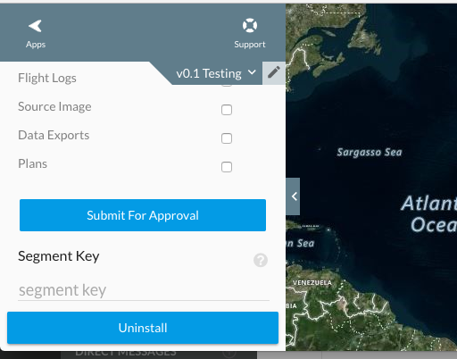

# Track

**Overview**

* [Track.send](track.md#tracksend)
* [Track.successCondition](track.md#tracksuccesscondition)
* [Accessing Tracked Data](track.md#accessing-tracked-data)

## Track.send

**Overview**

You can use `Track.send` to easily add tracking to your app.

```javascript
const eventName = String;
const optionalEventData = Object;
dronedeployApi.Track.send(eventName, optionalEventData);
```

**Example Call**

```javascript
dronedeployApi.Track.send('Crop Export Requested', {
  size: 100,
  member: true,
  timeUntilPurchaseInSeconds: 278
});
```

## Track.successCondition

**Overview**

`Track.successCondition()` should be called when the user performs the desired action in your app. This could be making a purchase, running a query, downloading a report, etc...

DroneDeploy will use this call to make your app more successful by....

* Marketing your app towards user types that score high in this success condition.
* Identifying inconsistencies in success conditions from different browsers or operating systems can reveal bugs.
* A / B testing of different versions of your app \(future feature\)

**Example Call**

```javascript
dronedeployApi.Track.successCondition()
```

## Accessing Tracked Data

You will be able to access the information DroneDeploy tracks about your app, including...

* App installs and uninstalls
* App renders
* All DroneDeploy API calls with arguments
* Custom track events via \`Track.send\`
* App runs via \`Track.successCondition\`

To opt into the recieving tracking information please create a free [segment](https://segment.com/) account and add [your write\_key](https://segment.com/docs/faqs/getting-started/how-to-find-writekey/) to your apps information.



